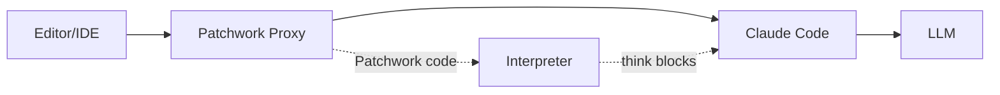
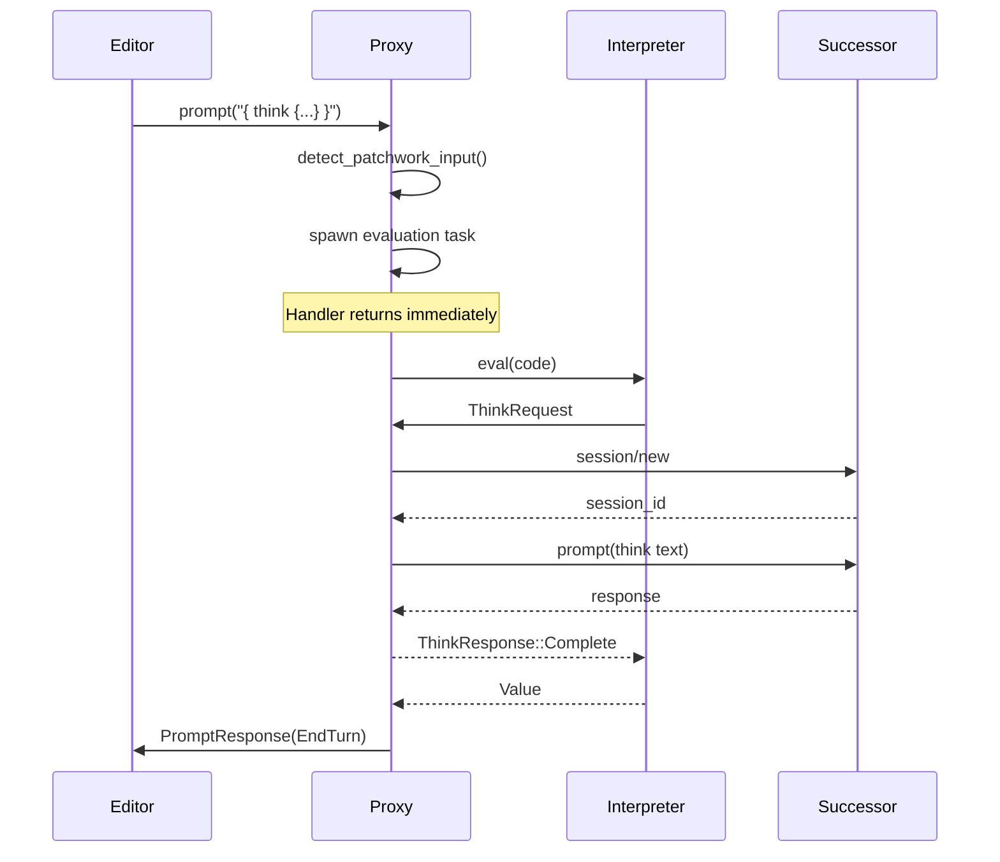
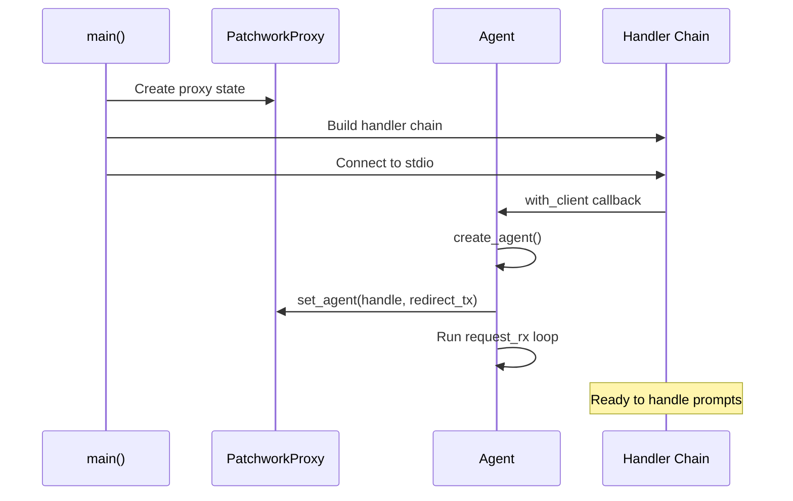

# The ACP Proxy

The ACP proxy integrates Patchwork into the Agent Communication Protocol chain. It sits between an editor (like Zed) and an agent (like Claude Code), intercepting prompts that contain Patchwork code.

## Where It Sits



The proxy intercepts `prompt` requests. If the prompt contains Patchwork code, the proxy executes it instead of forwarding to the successor. If not, the request passes through unchanged.

## Prompt Detection

The proxy recognizes two input forms:

| Pattern | Mode | Example |
|---------|------|---------|
| `{ ... }` | Block mode | `{ var x = 1; print(x) }` |
| `$ ...` | Shell shorthand | `$ ls -la` |

```rust
fn detect_patchwork_input(text: &str) -> Option<String> {
    let trimmed = text.trim_start();

    if trimmed.starts_with('{') {
        // Block mode - pass through as-is
        Some(text.to_string())
    } else if trimmed.starts_with('$') {
        // Shell shorthand - wrap in print block
        let command = trimmed[1..].trim_start();
        Some(format!(
            r#"{{
  var output = ($ {})
  print("```\n${{output}}```\n")
}}"#,
            command
        ))
    } else {
        None
    }
}
```

Shell shorthand automatically wraps the command in a block that captures and prints the output with markdown formatting.

## The Critical Spawning Pattern

The proxy **must not block** when handling a prompt. If it did, incoming responses (including responses to think blocks) wouldn't be dispatched, causing deadlock.

```rust
async fn handle_prompt(
    proxy: Arc<Mutex<PatchworkProxy>>,
    request: PromptRequest,
    cx: JrRequestCx<PromptResponse>,
) -> Result<(), sacp::Error> {
    // ... detection logic ...

    // CRITICAL: Spawn the evaluation as a separate task
    connection_cx.spawn(
        run_patchwork_evaluation(proxy, session_id, code, agent_handle, cx)
    )?;

    Ok(())  // Return immediately
}
```

The evaluation runs in a spawned task, freeing the message processing loop to dispatch responses.

## Evaluation Flow



## Print Forwarding

When Patchwork code calls `print()`, the output should appear in the editor. The proxy forwards print messages as session notifications:

```rust
fn forward_prints_to_notifications(
    rx: std::sync::mpsc::Receiver<String>,
    connection_cx: &JrConnectionCx,
    session_id: &str,
) {
    while let Ok(message) = rx.recv() {
        let notification = SessionNotification {
            session_id: session_id.to_string().into(),
            update: SessionUpdate::AgentMessageChunk(ContentChunk {
                content: ContentBlock::Text(TextContent {
                    text: message,
                    ...
                }),
            }),
        };

        connection_cx.send_notification(notification)?;
    }
}
```

This runs in a separate blocking task, forwarding each `print()` call as it happens.

## Session Notification Routing

Notifications from the successor (streaming LLM responses) need to reach the active think block. The proxy routes them to the redirect actor:

```rust
.on_receive_notification_from_successor({
    async move |notification: SessionNotification, _cx| {
        if let Some(redirect_tx) = proxy.lock().unwrap().redirect_tx() {
            redirect_tx.send(RedirectMessage::IncomingMessage(
                PerSessionMessage::SessionNotification(notification),
            ));
        }
        Ok(())
    }
})
```

This connects the ACP notification stream to the agent's redirect actor (covered in [The Agent](./agent.md)).

## Proxy State

The proxy tracks:

```rust
struct PatchworkProxy {
    /// Sessions with active evaluations
    active_sessions: HashSet<String>,
    /// Agent handle for think blocks
    agent_handle: Option<AgentHandle>,
    /// Redirect channel for session notifications
    redirect_tx: Option<UnboundedSender<RedirectMessage>>,
}
```

- **Active sessions**: Prevents concurrent evaluations on the same session
- **Agent handle**: Created once at startup, cloned for each evaluation
- **Redirect channel**: Routes successor notifications to think blocks

## Startup Sequence



The agent is created in the `with_client` callback, ensuring the connection is established before starting the request loop.

## Error Handling

The proxy handles three error cases:

| Error | Response |
|-------|----------|
| Parse error | `invalid_params` with message |
| Runtime error | `invalid_params` with message |
| Exception (`throw`) | `internal_error` with value |

```rust
match eval_result {
    Ok(value) => {
        cx.respond(PromptResponse { stop_reason: StopReason::EndTurn })?;
    }
    Err(EvalError::Exception(value)) => {
        cx.respond_with_error(
            sacp::Error::internal_error()
                .with_data(format!("Patchwork exception: {}", value)),
        )?;
    }
    Err(e) => {
        cx.respond_with_error(
            sacp::Error::invalid_params()
                .with_data(format!("Patchwork error: {}", e)),
        )?;
    }
}
```

## Why Spawn?

The spawning pattern deserves emphasis. Consider what happens without it:

1. Editor sends `prompt({ think {...} })`
2. Proxy starts evaluating, hits think block
3. Think block sends request to successor, waits for response
4. Successor sends response notification
5. **Deadlock**: The notification can't be dispatched because `handle_prompt` is blocked

By spawning the evaluation, the handler returns immediately, allowing the message loop to dispatch notifications. The evaluation task receives its responses through the redirect actor.

## Implementation Details

The proxy is implemented in `crates/patchwork-acp/src/main.rs`. Key functions:

| Function | Purpose |
|----------|---------|
| `detect_patchwork_input` | Check if prompt is Patchwork code |
| `handle_prompt` | Intercept prompts, spawn evaluation |
| `run_patchwork_evaluation` | Execute code in spawned task |
| `forward_prints_to_notifications` | Stream print output to editor |
