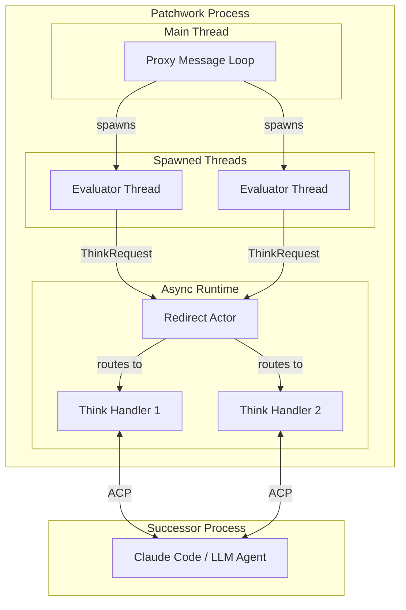
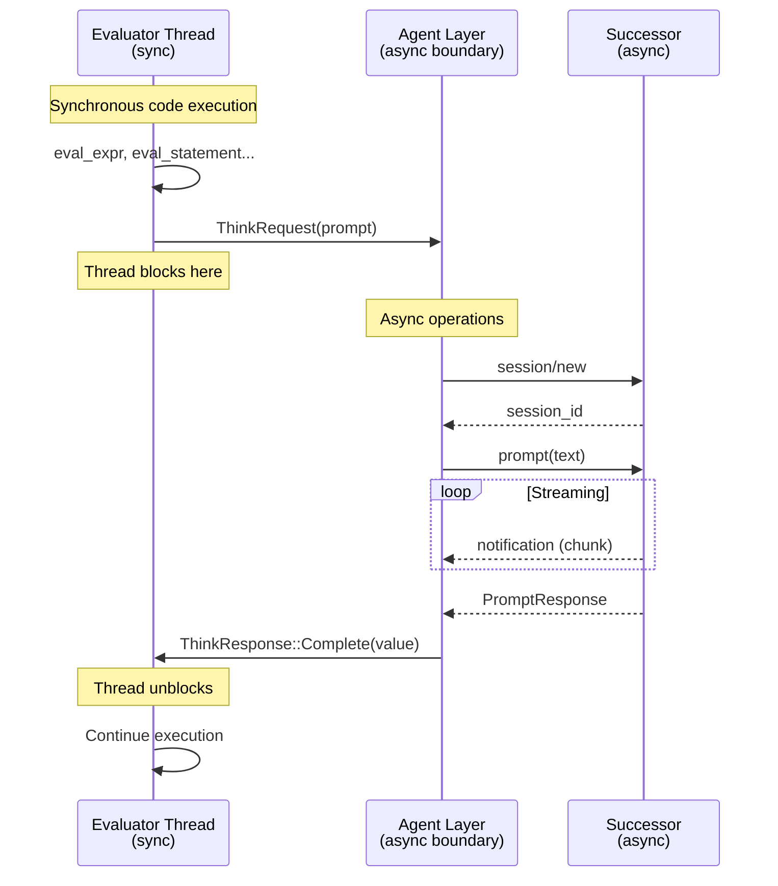

# The Threading Model

Patchwork's architecture involves multiple threads and async tasks working together. Before diving into execution details, it helps to have a clear map of what these components are, when they exist, and why they're named what they are.

## Overview



The system has two OS processes:
- **Patchwork process**: Runs the proxy, evaluator threads, and async tasks
- **Successor process**: An external agent (like Claude Code) that handles LLM communication

Within the Patchwork process, there are three kinds of execution contexts:
- **Main thread**: Runs the ACP message loop
- **Spawned threads**: One per active Patchwork evaluation (synchronous)
- **Async tasks**: The redirect actor and think handlers (in the tokio runtime)

## Naming Glossary

| Term | What It Is | Why That Name |
|------|------------|---------------|
| **Successor** | The next agent in the ACP protocol chain | ACP terminology—each proxy forwards requests to its "successor" in the chain |
| **Redirect Actor** | Long-lived async task that routes messages | "Actor" = task with message inbox; "redirect" = its job is routing messages to the right handler |
| **Evaluator Thread** | Synchronous thread running the Patchwork interpreter | Runs `eval_block`, `eval_expr`, etc. |
| **Think Handler** | Async task managing one think block's LLM conversation | Handles the back-and-forth with the successor for a single think block |

### Why "Successor"?

In ACP (Agent Communication Protocol), agents form a chain. Each agent can forward requests to the next agent in the chain—its "successor." The Patchwork proxy sits between the editor and Claude Code:

```
Editor → Patchwork Proxy → Claude Code (successor) → LLM
```

When Patchwork code contains a think block, the proxy creates an LLM session with its successor. The successor handles the actual LLM communication.

### Why "Actor"?

The redirect actor follows the [actor model](https://en.wikipedia.org/wiki/Actor_model) pattern:
- It's a long-lived task
- It receives messages via a channel (its "inbox")
- It processes messages in a loop
- It doesn't share mutable state—all communication happens via messages

The redirect actor is the only true actor in the system. Other components are either threads (evaluator), request handlers (proxy), or external processes (successor).

## Component Lifetimes

| Component | Created When | Destroyed When | How Many |
|-----------|--------------|----------------|----------|
| Proxy message loop | Process starts | Process exits | 1 |
| Redirect actor | Process starts | Process exits | 1 |
| Evaluator thread | Patchwork prompt detected | Evaluation completes | 1 per active evaluation |
| Think handler | Think block entered | Think block returns | 1 per active think block |
| Successor process | External (already running) | External | 1 (shared) |

The key insight: **the proxy and redirect actor live for the entire process lifetime**, while **evaluator threads and think handlers are created and destroyed as code executes**.

```mermaid
gantt
    title Component Lifetimes
    dateFormat X
    axisFormat %s

    section Process Lifetime
    Proxy Message Loop    :0, 100
    Redirect Actor        :0, 100

    section Per Evaluation
    Evaluator Thread 1    :10, 40
    Evaluator Thread 2    :50, 80

    section Per Think Block
    Think Handler A       :15, 35
    Think Handler B       :55, 75
```



## The Sync/Async Boundary

The evaluator is deliberately synchronous. This keeps the execution model simple—no async/await in user-facing semantics, natural blocking on think blocks, easy reasoning about variable scopes and control flow.

But LLM communication is inherently async. The agent layer bridges these worlds:



The evaluator thread blocks on a standard `std::sync::mpsc` channel. Meanwhile, the agent layer (running in the async runtime) handles all the async communication with the successor. When the response is ready, it sends back through the channel, unblocking the evaluator.

## Why Synchronous Evaluation?

Several design choices led to synchronous evaluation:

1. **Simpler mental model**: Users think about their code executing line by line, not as async tasks
2. **Natural blocking**: Think blocks conceptually "pause" execution until the LLM responds
3. **Scope clarity**: Variable lifetimes are straightforward—no async captures to reason about
4. **Exception propagation**: Rust's `?` operator works naturally through the call stack

The async complexity is isolated in the agent layer, invisible to both the language user and most of the interpreter code.

## Message Flow Summary

Putting it all together, here's how a think block executes:

1. **Evaluator thread** encounters a think block, sends `ThinkRequest` to the agent
2. **Agent** creates a think handler task, pushes it onto the redirect actor's stack
3. **Think handler** opens a session with the successor, sends the prompt
4. **Successor** streams response chunks back as notifications
5. **Redirect actor** routes notifications to the active think handler
6. **Think handler** accumulates the response, sends `ThinkResponse::Complete` to the evaluator
7. **Evaluator thread** unblocks, continues execution with the result

The redirect actor's stack enables nested think blocks—when an inner think starts, it pushes onto the stack and receives messages until it completes. This is covered in detail in [Nested Think Blocks](./nested-thinks.md).
